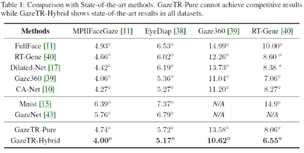

# GazeTR

We provide the code of GazeTR-Hybrid in "**Gaze Estimation using Transformer**".

We recommend you to use **data processing codes** provided in <a href="http://phi-ai.org/GazeHub/" target="_blank">*GazeHub*</a>.
You can direct run the method' code using the processed dataset.

<div align=center>  </div>

## Usage
### Directly use our code.

You should perform three steps to run our codes.

1. Prepare the data using our provided data processing codes.

2. Modify the `config/train/config_xx.yaml` and `config/test/config_xx.yaml`.

3. Run the commands.

To perform leave-one-person-out evaluation, you can run

```
python trainer/leave.py -s config/train/config_xx.yaml -p 0
```
Note that, this command only performs training in the `0th` person. You should modify the parameter of `-p` and repeat it.

To perform training-test evaluation, you can run

```
python trainer/total.py -s config/train/config_xx.yaml    
```

To test your model, you can run
```
python trainer/leave.py -s config/train/config_xx.yaml -t config/test/config_xx.yaml -p 0
```
or
```
python trainer/total.py -s config/train/config_xx.yaml -t config/test/config_xx.yaml
```

### Build your own project.
You can import the model in `model.py` for your own project.

We give an example. Note that, the `line 114` in `model.py` uses `.cuda()`. You should remove it if you run the model in CPU.
```
from model import Model
GazeTR = Model()

img = torch.ones(10, 3, 224 ,224).cuda()
img = {'face': img}
label = torch.ones(10, 2).cuda()

# for training
loss = GazeTR(img, label)

# for test
gaze = GazeTR(img)
```

## Pre-trained model
You can download from <a href="https://drive.google.com/file/d/1WEiKZ8Ga0foNmxM7xFabI4D5ajThWAWj/view?usp=sharing" target="_blank"> google drive </a> or <a href="https://pan.baidu.com/s/1GEbjbNgXvVkisVWGtTJm7g" target="_blank"> baidu cloud disk </a> with code `1234`. 
  
This is the pre-trained model in ETH-XGaze dataset with 50 epochs and 512 batch sizes. 

## Performance



## Links to gaze estimation codes.

- A Coarse-to-fine Adaptive Network for Appearance-based Gaze Estimation, AAAI 2020 (Coming soon)
- [Gaze360: Physically Unconstrained Gaze Estimation in the Wild](https://github.com/yihuacheng/Gaze360), ICCV 2019
- [Appearance-Based Gaze Estimation Using Dilated-Convolutions](https://github.com/yihuacheng/Dilated-Net), ACCV 2019
- [Appearance-Based Gaze Estimation via Evaluation-Guided Asymmetric Regression](https://github.com/yihuacheng/ARE-GazeEstimation), ECCV 2018
- [RT-GENE: Real-Time Eye Gaze Estimation in Natural Environments](https://github.com/yihuacheng/RT-Gene), ECCV 2018
- [MPIIGaze: Real-World Dataset and Deep Appearance-Based Gaze Estimation](https://github.com/yihuacheng/Gaze-Net), TPAMI 2017
- [It’s written all over your face: Full-face appearance-based gaze estimation](https://github.com/yihuacheng/Full-face), CVPRW 2017
- [Eye Tracking for Everyone](https://github.com/yihuacheng/Itracker), CVPR 2016
- [Appearance-Based Gaze Estimation in the Wild](https://github.com/yihuacheng/Mnist), CVPR 2015

## License
The code is under the license of [CC BY-NC-SA 4.0 license](https://creativecommons.org/licenses/by-nc-sa/4.0/).

## Contact 
Please email any questions or comments to yihua_c@buaa.edu.cn.
